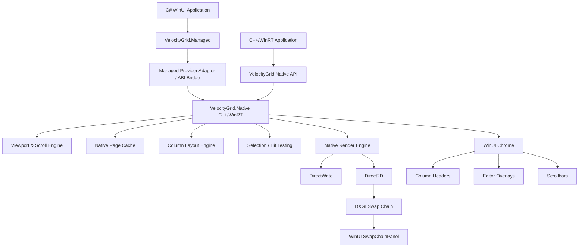

# VelocityGrid
## Detailed Design and Development Plan

**Project:** VelocityGrid  
**Primary target:** Windows App SDK / WinUI desktop applications  
**Primary implementation:** C++20 / C++/WinRT  
**Primary consumer experience:** C# / .NET WinUI applications  
**Secondary consumer experience:** Native C++/WinRT WinUI applications  
**Status:** Initial architecture and development plan  
**Purpose:** Flagship open-source component demonstrating high-performance Windows desktop UI engineering

---

# 1. Executive Summary

VelocityGrid is a high-performance, viewport-driven data grid for WinUI applications.

It is specifically intended for applications that must display very large logical datasets, rapidly changing data, or remote/on-demand data while maintaining bounded memory usage and predictable UI latency.

VelocityGrid is **not** intended to be another general-purpose "Excel clone" or a drop-in replacement for every desktop DataGrid scenario. Its differentiator is architectural:

> **The grid does not assume that the application's entire dataset exists as an in-memory collection. The viewport drives data acquisition. VelocityGrid requests, caches, and renders only the subset of data required for the current viewport and a bounded predictive cache around it.**

This approach is based on a design previously proven successfully in a large WPF front-office trading application: the grid controls the data-access pattern rather than relying solely on UI-element virtualization over an already-materialized collection.

The new implementation will take that idea further by combining:

- native C++/WinRT implementation;
- viewport-driven data virtualization;
- bounded native caching;
- batched C# ↔ C++ interoperability;
- custom rendering using Direct2D and DirectWrite;
- a small, stable WinUI visual tree;
- asynchronous data fetching;
- predictive prefetching;
- cancellation of obsolete requests;
- allocation-conscious hot paths;
- instrumentation and benchmarks as first-class product features;
- a C#-friendly public API.

The aim is not merely to make a fast grid. The aim is to create a control whose **architecture makes performance predictable**.

---

# 2. Product Positioning

## 2.1 One-line description

> **VelocityGrid is a native, viewport-driven virtual data grid for WinUI, designed for massive and rapidly changing datasets.**

## 2.2 Short product description

VelocityGrid is a C++/WinRT WinUI component that exposes a C#-friendly provider API. Rather than binding a large collection to a conventional item-control hierarchy, VelocityGrid calculates which logical rows intersect the current viewport, requests only those rows plus a bounded cache, and renders the visible cells using a native rendering path.

## 2.3 Intended workloads

VelocityGrid is particularly suited to:

- front-office trading applications;
- market-data displays;
- order books and depth-of-market displays;
- trade blotters;
- large operational datasets;
- telemetry viewers;
- log viewers;
- monitoring consoles;
- database-backed record browsers;
- remote or paged data sources;
- datasets containing hundreds of thousands or millions of logical rows;
- high-frequency update scenarios;
- applications where p95/p99 UI latency matters;
- applications where memory use must remain bounded as logical row count grows.

## 2.4 What makes VelocityGrid different

The product should not market itself primarily as "C++ therefore fast."

Its differentiation should be expressed as four architectural properties:

1. **Viewport-driven data acquisition**  
   The grid tells the provider exactly what range of data it currently needs.

2. **Bounded state**  
   Memory consumption is driven primarily by the viewport and configured cache budget, not by total dataset size.

3. **Native hot path**  
   Scrolling, viewport calculations, cached row handling, formatting caches, hit-testing, and rendering are designed to remain on the native side whenever practical.

4. **Minimal visual tree**  
   The grid body is not represented as thousands of XAML controls, bindings, dependency objects, or templates.

---

# 3. Project Goals

VelocityGrid should demonstrate both a useful component and a body of serious Windows desktop engineering work.

## 3.1 Product goals

The project should:

- display datasets containing millions of logical rows without materializing all rows;
- jump or scroll to distant positions without traversing intermediate rows;
- keep memory usage approximately bounded as logical row count increases;
- support asynchronous/remote data providers;
- cancel stale fetches during rapid scrolling;
- prefetch intelligently around the viewport;
- handle rapidly changing values efficiently;
- provide smooth and responsive scrolling;
- minimize allocations on performance-critical paths;
- avoid per-cell managed/native calls;
- expose a natural API to C# WinUI developers;
- remain usable from C++/WinRT applications;
- support theming, keyboard navigation, selection, and accessibility;
- produce objective performance telemetry;
- be distributable as a reusable package.

## 3.2 Portfolio goals

The project should clearly demonstrate expertise in:

- enterprise desktop application architecture;
- WinUI and Windows App SDK;
- C++20;
- C++/WinRT;
- C#/WinRT interoperability;
- Direct2D;
- DirectWrite;
- DXGI;
- data virtualization;
- cache design;
- asynchronous systems;
- cancellation and stale-work elimination;
- XAML custom control authoring;
- memory/performance engineering;
- UI latency analysis;
- UI Automation/accessibility;
- benchmarking and profiling;
- component API design.

---

# 4. Explicit Non-Goals

The following should be considered **out of scope for the initial product** unless later evidence strongly justifies them.

VelocityGrid is not intended initially to provide:

- pivot-table functionality;
- spreadsheet formulas;
- merged cells;
- arbitrary nested XAML controls in every cell;
- arbitrary DataTemplates in the high-performance rendering path;
- rich document layout;
- printing;
- reporting;
- charting;
- tree-grid hierarchy;
- grouping with complex expandable group trees;
- row-details templates;
- variable-height rows;
- automatic reflection over arbitrary CLR objects on every render;
- automatic client-side sorting of millions of rows;
- automatic client-side filtering of millions of rows;
- a complete replacement for every existing commercial DataGrid;
- binary compatibility with WPF DataGrid APIs;
- exact emulation of Excel.

These are deliberately excluded because they would dilute the core engineering proposition.

> **VelocityGrid should be excellent at large, dense, virtualized tabular data before it becomes broad.**

---

# 5. Design Principles

## 5.1 The viewport is authoritative

The control should always know:

- the first visible logical row;
- the last visible logical row;
- the partially visible rows;
- the current horizontal column range;
- the scroll direction;
- the approximate scroll velocity.

All data acquisition and cache policy should originate from this information.

## 5.2 Logical row count is not materialized row count

A provider may report:

```text
RowCount = 10,000,000
```

VelocityGrid may hold only:

```text
Visible rows:           60
Prefetched rows above: 120
Prefetched rows below: 180
Total resident rows:   ~360
```

The exact numbers are configurable, but the principle is fixed.

## 5.3 Never perform per-cell ABI chatter

The native grid must not repeatedly call managed code to retrieve individual values during painting.

Bad:

```text
C++ renderer
  -> C# GetRow(...)
  -> C# GetCell(...)
  -> C# GetCell(...)
  -> C# GetCell(...)
  -> ...
```

Good:

```text
C++ grid
  -> request one range/page
  -> receive one batch
  -> cache native representation
  -> render many frames from native state
```

## 5.4 The hot path should avoid managed dependencies

Once a viewport page is in the native cache, the following should not require managed callbacks:

- frame rendering;
- text drawing;
- grid-line drawing;
- basic hit-testing;
- hover state;
- selection visualization;
- scroll-position calculations;
- cached value lookup;
- cached text layout lookup.

This does **not** mean VelocityGrid can promise complete immunity from .NET GC pauses. WinUI input dispatch and the host process still participate in a managed/native application.

The design goal is more precise:

> **Minimize the amount of latency-critical work that requires managed allocation or managed execution.**

## 5.5 Prefer architectural wins over micro-optimizations

The largest gains are expected to come from:

- not constructing millions of objects;
- not creating a large XAML visual tree;
- not creating a BindingExpression per visible cell;
- not traversing intermediate rows;
- not fetching unseen data;
- not performing stale work;
- not crossing the ABI for each cell.

Micro-optimizations should follow measurement.

## 5.6 Performance claims must be measured

Every material optimization should be accompanied by:

- a benchmark;
- trace evidence;
- allocation evidence;
- latency measurements;
- or a before/after comparison.

---

# 6. High-Level Architecture



---

# 7. Proposed Repository Structure

```text
VelocityGrid/
│
├── src/
│   ├── VelocityGrid.Native/
│   │   ├── Control/
│   │   ├── Rendering/
│   │   ├── Data/
│   │   ├── Cache/
│   │   ├── Viewport/
│   │   ├── Columns/
│   │   ├── Selection/
│   │   ├── Input/
│   │   ├── Automation/
│   │   ├── Diagnostics/
│   │   └── Interop/
│   │
│   ├── VelocityGrid.Managed/
│   │   ├── DataProvider/
│   │   ├── Adapters/
│   │   ├── Models/
│   │   └── Diagnostics/
│   │
│   └── VelocityGrid.WinUI/
│       ├── Themes/
│       ├── Templates/
│       └── Resources/
│
├── samples/
│   ├── VelocityGrid.Sample.Basic/
│   ├── VelocityGrid.Sample.MillionRows/
│   ├── VelocityGrid.Sample.RemoteData/
│   ├── VelocityGrid.Sample.LiveMarket/
│   └── VelocityGrid.Sample.GCStress/
│
├── tests/
│   ├── VelocityGrid.Native.Tests/
│   ├── VelocityGrid.Managed.Tests/
│   ├── VelocityGrid.Integration.Tests/
│   └── VelocityGrid.Performance/
│
├── benchmarks/
│   ├── Scrolling/
│   ├── RandomJump/
│   ├── UpdateRate/
│   ├── Memory/
│   ├── GCStress/
│   └── Rendering/
│
├── docs/
│   ├── architecture.md
│   ├── data-virtualization.md
│   ├── rendering.md
│   ├── interop.md
│   ├── performance.md
│   ├── accessibility.md
│   └── provider-guide.md
│
└── tools/
    ├── TraceAnalysis/
    └── DataGenerators/
```

---

# 8. Component Boundaries

## 8.1 VelocityGrid.Native

Primary responsibilities:

- custom WinUI control implementation;
- viewport calculations;
- row-index calculations;
- scrolling;
- page cache;
- request scheduling;
- cancellation;
- native row representation;
- rendering;
- column layout;
- selection;
- hit-testing;
- keyboard navigation;
- diagnostics;
- C++ native data-provider contract;
- WinRT-facing ABI.

Language:

- C++20;
- C++/WinRT where WinRT integration is required;
- ordinary modern C++ internally wherever WinRT semantics are unnecessary.

## 8.2 VelocityGrid.Managed

Purpose:

- make VelocityGrid pleasant for C# developers;
- hide ABI-oriented data structures;
- translate idiomatic .NET provider results into coarse-grained native batches;
- provide async and cancellation-friendly APIs;
- expose helpers for common scenarios.

The managed package should be thin.

It should **not** recreate the rendering or virtualization engine.

## 8.3 VelocityGrid.WinUI

Contains:

- `Generic.xaml`;
- default theme resources;
- header templates;
- scrollbars;
- focus visuals;
- optional overlay editors;
- light/dark/high-contrast resources.

The performance-critical grid body should not be implemented as a large XAML item hierarchy.

---

# 9. WinUI Control Model

The public control should behave like a normal WinUI control.

Conceptual XAML:

```xml
<velocity:VelocityGrid
    DataSource="{x:Bind ViewModel.Trades}"
    RowHeight="24"
    SelectionMode="Extended"
    CacheAhead="2"
    CacheBehind="1">

    <velocity:VelocityGrid.Columns>
        <velocity:TextColumn
            Key="Symbol"
            Header="Symbol"
            Width="100" />

        <velocity:NumericColumn
            Key="Bid"
            Header="Bid"
            Width="90"
            HorizontalAlignment="Right" />

        <velocity:NumericColumn
            Key="Ask"
            Header="Ask"
            Width="90"
            HorizontalAlignment="Right" />
    </velocity:VelocityGrid.Columns>
</velocity:VelocityGrid>
```

Internally, the default template can be approximately:

```text
VelocityGrid
│
├── HeaderPresenter        [WinUI]
├── GridSurface            [SwapChainPanel]
├── VerticalScrollBar      [WinUI]
├── HorizontalScrollBar    [WinUI]
└── OverlayLayer           [WinUI]
     ├── editor
     ├── tooltip
     └── accessibility/focus visuals when needed
```

This hybrid model deliberately uses WinUI where it offers leverage and native rendering where XAML object density would be costly.

---

# 10. Data Provider Architecture

The data-provider contract is the most important public architectural decision.

VelocityGrid must never require a giant `ObservableCollection`.

The provider answers questions about the logical dataset.

## 10.1 Managed high-level contract

A C# API may conceptually resemble:

```csharp
public interface IVelocityGridDataProvider
{
    long RowCount { get; }

    ValueTask<VelocityGridPage> GetRowsAsync(
        VelocityGridRange range,
        VelocityGridFetchContext context,
        CancellationToken cancellationToken);
}
```

The range contains:

```csharp
public readonly record struct VelocityGridRange(
    long StartRow,
    int RowCount);
```

The fetch context may later contain:

```text
Sort descriptors
Filter descriptors
Requested columns
Request priority
Viewport generation/version
```

The important rule is:

> **GetRowsAsync returns a batch, never a single cell.**

## 10.2 Why the provider owns sorting and filtering

For massive or remote datasets, the grid cannot assume it can sort or filter every row locally.

Therefore:

```text
User clicks Price header
        |
        v
VelocityGrid creates sort descriptor
        |
        v
Provider receives sort state
        |
        v
Provider changes logical row ordering
        |
        v
Grid invalidates cache
        |
        v
Grid requests new viewport
```

The provider might implement sorting in:

- SQL;
- an in-memory native index;
- a server API;
- a market-data engine;
- a database cursor;
- another service.

This keeps VelocityGrid scalable.

## 10.3 Native provider contract

A native application should be able to bypass the managed adapter.

The exact ABI should be designed after a spike, but the conceptual API is:

```cpp
struct IVelocityGridNativeDataProvider
{
    int64_t RowCount() const;

    task<PageBuffer> GetRowsAsync(
        RowRange range,
        FetchContext context,
        cancellation_token token);
};
```

Native providers may be able to return data with minimal copying.

---

# 11. Data Transfer Format

This area requires an early proof-of-concept.

The managed convenience API should not force application developers to author binary buffers manually, but the native boundary should avoid creating a WinRT object per cell.

## 11.1 Preferred direction

Managed application:

```text
Friendly .NET page representation
          |
          v
VelocityGrid.Managed adapter
          |
          v
flat/batched ABI representation
          |
          v
VelocityGrid.Native cache
```

Possible transfer representations to benchmark:

1. flat arrays of value structs;
2. column-oriented buffers;
3. `IBuffer` containing a compact page representation;
4. separate primitive and UTF-8 text buffers;
5. generated ABI structs where practical.

## 11.2 Design criteria

The selected representation should minimize:

- object count;
- ABI transitions;
- copies;
- temporary strings;
- boxing;
- reflection;
- allocations proportional to cell count.

It should maximize:

- contiguous access;
- cache locality;
- batch processing;
- predictable ownership;
- easy cancellation/disposal.

## 11.3 Important API rule

The pleasant C# API and the efficient native representation do **not** need to be identical.

The managed adapter exists specifically to separate those concerns.

---

# 12. Row Representation

For the MVP, VelocityGrid should operate primarily on **display-ready cell values** rather than attempting to become a complete data-model framework.

A page may logically contain:

```text
Page
├── StartRow
├── RowCount
├── ColumnCount
├── Cell display values
├── optional style flags
└── optional row state
```

Sorting and filtering remain provider responsibilities.

Future typed-value support can be added where it provides measurable value.

## 12.1 Why not bind arbitrary CLR objects?

Arbitrary object binding encourages:

- reflection;
- property descriptors;
- boxing;
- per-cell interface calls;
- uncontrolled allocation;
- complex lifetime management.

That conflicts with VelocityGrid's central proposition.

A convenience object adapter may eventually exist, but it should be clearly documented as the convenience path rather than the maximum-performance path.

---

# 13. Viewport Engine

The viewport engine is the conceptual heart of VelocityGrid.

For the MVP, use **fixed row height**.

Given:

```text
ViewportHeight
RowHeight
VerticalScrollPosition
```

calculate:

```text
FirstVisibleRow
LastVisibleRow
VisibleRowCount
PartialTopRow
PartialBottomRow
```

The logical dataset can contain millions or billions of rows without creating a corresponding pixel-sized XAML panel.

## 13.1 Logical scrolling

The scrollbar should represent logical row position rather than a gigantic physical canvas.

For fixed-height rows:

```text
FirstVisibleRow = floor(scrollOffset / rowHeight)
```

or the scrollbar may directly operate in logical row units.

This avoids needing an enormous virtual panel extent.

## 13.2 Random jumps

Random access is a first-class requirement.

Dragging the scrollbar from row 50,000 to row 8,000,000 must:

1. update logical viewport position immediately;
2. invalidate obsolete outstanding requests;
3. request the new viewport range;
4. not traverse intermediate rows;
5. render whatever valid cached state is available;
6. replace it when the new page arrives.

---

# 14. Page Cache

The page cache must be bounded.

It should be impossible for ordinary scrolling to cause cache size to grow indefinitely.

## 14.1 Initial strategy

Start with a simple range/page cache.

Example:

```text
Visible viewport:       rows 1000-1059
Cache behind:           rows 880-999
Cache ahead:            rows 1060-1239
```

The asymmetry can change according to scroll direction.

## 14.2 Cache configuration

Potential public settings:

```text
CacheAheadViewports
CacheBehindViewports
MaximumCachedRows
MaximumCacheBytes
```

The implementation should eventually prefer a **memory budget** over purely row-count limits because row width varies.

## 14.3 Eviction

Initial algorithm:

- LRU or segmented LRU;
- never evict currently visible rows;
- favor data in current movement direction;
- evict stale sort/filter generations immediately;
- obsolete pages should be reclaimable without UI-thread blocking.

---

# 15. Predictive Prefetch

VelocityGrid should exploit scroll direction and velocity.

Slow downward scrolling:

```text
small cache behind
larger cache ahead
```

Fast scrollbar dragging:

```text
cancel most previous work
prioritize latest destination
avoid speculative fetch storms
```

Idle viewport:

```text
fill configured cache around viewport
```

Prefetch should be adaptive rather than blindly aggressive.

A remote provider should never be flooded with dozens of stale range requests merely because the scrollbar thumb moved rapidly.

---

# 16. Request Generations and Cancellation

Every viewport/data state should have a generation.

A generation changes when any of the following materially changes:

- sort order;
- filter;
- provider reset;
- dataset version;
- large viewport relocation.

Each fetch carries:

```text
Generation
Range
RequestId
Priority
CancellationToken
```

When results return, VelocityGrid must verify that they are still useful.

Late obsolete results are discarded or optionally admitted only if they are valid and useful for the current cache.

This avoids stale asynchronous work corrupting the viewport.

---

# 17. Rendering Architecture

## 17.1 Why not render the body as XAML cells?

A conventional XAML cell hierarchy can involve:

- DependencyObjects;
- ContentPresenters;
- TextBlocks;
- Borders;
- templates;
- bindings;
- measurement;
- layout;
- style lookup;
- visual-tree traversal.

VelocityGrid should avoid multiplying that infrastructure by visible row count × visible column count.

## 17.2 Proposed body renderer

Use:

- Direct3D device;
- DXGI swap chain;
- Direct2D device context;
- DirectWrite text rendering;
- WinUI `SwapChainPanel` as the host.

Conceptually:

```text
Native row cache
      |
      v
Column layout
      |
      v
Formatting/text-layout cache
      |
      v
Direct2D / DirectWrite
      |
      v
DXGI swap chain
      |
      v
SwapChainPanel
```

## 17.3 Rendering loop

A frame should perform roughly:

```text
Determine dirty state
Determine visible rows
Determine visible columns
Draw backgrounds
Draw selection/hover state
Draw cell text
Draw grid lines
Draw focus state
Present
```

No managed calls should be required when rendering cached data.

## 17.4 Full redraw first

The initial renderer should favor correctness and simplicity.

Start with full viewport redraws.

Only add:

- dirty rectangles;
- partial redraws;
- retained command lists;
- more sophisticated caching

after profiling proves they are needed.

---

# 18. Text Rendering

Dense grids are text-heavy.

DirectWrite should be treated as a central subsystem rather than an incidental API.

Potential caches:

- text-format objects by column/style;
- measured widths;
- text layouts for repeated strings;
- numeric-format results;
- glyph/layout caches where justified.

Do not pre-optimize all text handling.

Start with a correct DirectWrite renderer, instrument it, then optimize repeated values and measurement hotspots.

---

# 19. Column Model

MVP column capabilities:

- key;
- header;
- fixed width;
- minimum width;
- maximum width;
- alignment;
- text/numeric rendering hints;
- visibility;
- display index.

Phase-two capabilities:

- resize;
- reorder;
- frozen columns;
- header-click sorting;
- style rules;
- custom formatters.

Initially avoid arbitrary XAML cell templates.

A future escape hatch may support a slower "hosted XAML cell" mode for selected columns, but it must be clearly separated from the native fast path.

---

# 20. Scrolling

## 20.1 Vertical scrolling

MVP:

- fixed row height;
- logical row-index scrolling;
- mouse wheel;
- scrollbar arrows/page;
- thumb drag;
- keyboard PageUp/PageDown/Home/End.

## 20.2 Horizontal scrolling

Columns are laid out in native coordinates.

The grid should calculate visible columns and avoid work for fully off-screen columns.

## 20.3 Smooth pixel scrolling

This may be added after the row-based engine is stable.

The architecture must not depend on smooth scrolling in order to achieve high performance.

---

# 21. Selection and Hit Testing

MVP should support:

- single row selection;
- single cell selection;
- extended row selection;
- keyboard navigation;
- hover state.

Native hit-testing should translate:

```text
pointer x/y
    ->
logical row index
    +
column index
```

without requiring a XAML element per cell.

Selection state should be represented compactly.

Large range selections should not materialize one object per selected row.

---

# 22. Editing Strategy

Editing is **not part of the first rendering milestone**.

When introduced, the preferred architecture is an overlay model.

```text
Native rendered grid
       |
       +--> user activates cell
                |
                v
       WinUI editor positioned
       over cell rectangle
```

Benefits:

- normal WinUI TextBox/ComboBox interaction;
- IME support;
- accessibility leverage;
- no permanent XAML cell tree;
- only one/few editors exist at a time.

The editing API should support:

- begin edit;
- validate;
- commit;
- cancel;
- asynchronous commit where appropriate.

---

# 23. Streaming Updates

High-frequency updates are a core future capability and should influence the design from the beginning.

The provider should eventually be able to notify VelocityGrid of batched changes:

```text
RowsUpdated(range)
RowsInserted(range)
RowsRemoved(range)
Reset()
```

For market-data-style workloads, a more efficient update channel may be required.

Important rule:

> **Update notification should be batch-oriented.**

Do not require one managed event per changed cell.

The native cache should coalesce multiple changes into one render invalidation where possible.

---

# 24. GC Resilience

VelocityGrid must be precise in its claims.

It should not claim that a C# host can never affect UI latency during garbage collection.

Instead, design for:

- bounded managed allocation generated by the grid;
- no managed callback required for painting cached data;
- native cache ownership;
- native formatting/rendering;
- optional native render thread;
- batched provider transitions;
- prefetch sufficient to tolerate temporary provider delays.

A dedicated native rendering thread should be investigated after the basic renderer is stable.

Benchmark whether it materially improves:

- p95 frame time;
- p99 frame time;
- frame continuity during forced managed GC;
- data-to-screen latency.

If the benefit is not meaningful, do not keep complexity merely for architectural purity.

---

# 25. Threading Model

Initial model:

### UI thread
Responsible for:

- WinUI control lifecycle;
- dependency properties;
- template application;
- high-level input;
- scrollbar interaction;
- SwapChainPanel association;
- raising public events.

### Data/request scheduler
Responsible for:

- provider request coordination;
- cancellation;
- request generations;
- cache-fill work.

### Rendering
Start with the simplest safe native model.

Then benchmark a dedicated native rendering thread.

### Rule

Native state shared across threads should have explicit ownership.

Avoid a design where "thread-safe" means placing one giant mutex around the grid.

Prefer:

- immutable page snapshots;
- generation swaps;
- narrow locks;
- lock-free read snapshots where justified;
- queues for state transitions.

---

# 26. Memory Model

Memory should be measured and designed deliberately.

Track separately:

- page data;
- text buffers;
- text-layout cache;
- GPU resources;
- column metadata;
- selection structures;
- outstanding request buffers;
- managed adapter allocations.

The project should expose diagnostic counters.

Example:

```text
Logical rows:              10,000,000
Visible rows:                      62
Native cached rows:               360
Native cache bytes:          1.8 MiB
Text cache bytes:            0.7 MiB
Outstanding fetches:               1
Managed allocations/frame:         0
```

The exact counters will evolve, but observability should exist from early development.

---

# 27. Diagnostics

VelocityGrid should include optional runtime diagnostics.

Possible counters:

- current visible row range;
- cached row count;
- cache bytes;
- cache hit ratio;
- fetch count;
- canceled fetch count;
- stale result count;
- average fetch latency;
- current render time;
- p95 render time;
- dropped/late frame count;
- text layouts created;
- render invalidations;
- managed/native transition counts where measurable.

Expose a diagnostics overlay in sample applications.

This makes performance engineering visible rather than anecdotal.

---

# 28. Accessibility

Immediate-mode rendering must not become an excuse for inaccessible UI.

Before 1.0, VelocityGrid must provide meaningful UI Automation behavior.

Requirements should include:

- grid semantics;
- row/cell navigation;
- column headers;
- selection state;
- focus state;
- value/name exposure;
- off-screen/virtualized item semantics where appropriate;
- high-contrast support.

The exact WinUI AutomationPeer / provider strategy should be designed as a dedicated workstream.

Accessibility should not block the earliest renderer prototype, but it is a **release requirement**, not an optional polish item.

---

# 29. Theming

VelocityGrid should integrate with WinUI themes.

Support before 1.0:

- Light;
- Dark;
- High Contrast;
- theme-resource overrides.

Native rendering colors should be derived from WinUI theme resources rather than hard-coded.

Theme changes should invalidate only what is necessary.

---

# 30. DPI and Scaling

The renderer must be DPI-aware.

Requirements:

- react correctly to monitor DPI changes;
- use device-independent units at the WinUI API boundary;
- convert to physical pixels for swap-chain rendering;
- keep text crisp;
- recalculate viewport rows after DPI/scale changes;
- recreate size-dependent graphics resources correctly.

---

# 31. Error Handling

Provider failures must not crash the control.

A fetch can result in:

- success;
- cancellation;
- stale completion;
- transient failure;
- permanent failure.

The grid should support an error-state callback/event.

Possible viewport behavior:

```text
cached data remains visible
+
failed page region shows a lightweight error state
+
optional retry
```

Never block the UI thread waiting synchronously for a provider.

---

# 32. Public API Philosophy

The API should be:

- small;
- explicit;
- async-friendly;
- C#-friendly;
- versionable;
- performance-conscious.

Avoid exposing internal rendering details unnecessarily.

Avoid an enormous property surface in v1.

Every feature added to the API creates a compatibility obligation.

---

# 33. MVP Feature Set

The first usable MVP should support:

### Required

- C++/WinRT WinUI control;
- C# sample consumer;
- fixed row height;
- vertical scrolling;
- horizontal scrolling;
- configurable columns;
- native text rendering;
- asynchronous provider;
- viewport-based row requests;
- bounded page cache;
- request cancellation;
- random jumps;
- single-row selection;
- keyboard navigation;
- light/dark theme;
- performance counters;
- million-row synthetic sample.

### Explicitly deferred

- editing;
- grouping;
- frozen columns;
- arbitrary templates;
- variable row height;
- tree hierarchy;
- advanced filtering UI;
- rich cell controls;
- export;
- printing.

---

# 34. Version 0.2 / 0.3 Candidates

After the MVP is benchmarked:

- column resize;
- column reorder;
- multi-selection;
- selection ranges;
- copy to clipboard;
- header sorting;
- provider-side filtering;
- streaming update batches;
- frozen columns;
- editor overlays;
- async commit;
- richer styling;
- custom formatters;
- diagnostic overlay;
- improved accessibility.

---

# 35. Performance Targets

These are engineering targets, not marketing claims, until measured.

Initial benchmark scenarios should include:

## 35.1 Logical-size scalability

Datasets:

```text
100,000 rows
1,000,000 rows
10,000,000 rows
```

Expected property:

> Memory use should remain mostly dependent on viewport/cache configuration, not total logical row count.

## 35.2 Random jump

Jump from:

```text
row 100
```

to:

```text
row 8,500,000
```

Expected:

- no traversal of intermediate rows;
- obsolete fetch canceled;
- one new priority viewport fetch;
- UI remains responsive.

## 35.3 Continuous scroll

Measure:

- frame time;
- p50;
- p95;
- p99;
- worst frame;
- fetch/cache hit behavior.

## 35.4 Update storm

Synthetic examples:

```text
1,000 updates/sec
10,000 updates/sec
50,000 updates/sec
```

Only visible/cached rows should cause meaningful rendering work.

## 35.5 GC stress

A C# host intentionally creates allocation pressure while VelocityGrid continuously scrolls or renders cached streaming data.

Measure:

- frame continuity;
- p95/p99 frame time;
- provider delays;
- native renderer continuity;
- dropped frames.

Do not claim complete GC immunity.

The test exists to quantify sensitivity.

## 35.6 Memory

Track:

- working set;
- private bytes;
- native cache;
- GPU allocations;
- managed heap contribution.

---

# 36. Benchmark Philosophy

The project must avoid misleading benchmarks.

Rules:

1. Publish hardware/software configuration.
2. Publish dataset characteristics.
3. Distinguish logical rows from resident rows.
4. Distinguish cached from uncached tests.
5. Use repeated runs.
6. Publish p95/p99, not only averages.
7. Measure release builds.
8. Avoid comparing different feature sets unfairly.
9. Keep benchmark source code in the repository.
10. Treat regressions as test failures where practical.

---

# 37. Development Roadmap

## Phase 0 — Repository and Toolchain

Goal: validate the manually-created Visual Studio solution and establish reproducible builds.

Tasks:

- **first perform the mandatory solution preflight defined in section 41.0 and report the result before making implementation changes;**
- confirm the five manually-created projects use the intended template families, languages, SDKs, packaging model, and compatible build architecture;
- build the untouched template solution to establish a clean baseline where possible;
- correct only concrete setup issues found during validation;
- create/initialize the Git repository if not already present;
- define licence;
- confirm C++20 configuration;
- confirm compatible Windows App SDK usage across projects;
- confirm C++/WinRT component setup;
- confirm the C# WinUI sample can reference the intended component architecture;
- add CI build;
- add formatting/linting;
- add architecture decision records;
- establish public-repository documentation conventions.

Exit criteria:

- clone → build → run sample;
- sample displays an empty VelocityGrid control.

---

## Phase 1 — Native Rendering Spike

Goal: prove the rendering stack.

Build a control containing a SwapChainPanel that renders synthetic rows.

Tasks:

- initialize D3D/DXGI;
- initialize Direct2D;
- initialize DirectWrite;
- handle resize;
- handle DPI;
- draw fixed row rectangles;
- draw text;
- present;
- respond to theme changes.

No real data provider yet.

Exit criteria:

- 100 visible synthetic rows render correctly;
- resize works;
- light/dark works;
- no large XAML visual tree exists for cells.

---

## Phase 2 — Viewport and Scroll Engine

Goal: prove millions of logical rows without materializing them.

Tasks:

- implement row-height model;
- implement visible-row calculations;
- implement vertical scrollbar mapping;
- implement mouse wheel;
- implement PageUp/PageDown;
- implement Home/End;
- implement random thumb jumps;
- implement horizontal scroll/column clipping.

Synthetic row values can be generated mathematically from row index.

Exit criteria:

- 10 million logical rows;
- instant random navigation;
- memory does not scale with logical row count.

---

## Phase 3 — Native Cache and Request Scheduler

Goal: separate viewport from data availability.

Tasks:

- page/range representation;
- LRU or segmented cache;
- viewport generation;
- request IDs;
- cancellation;
- stale-result handling;
- cache-ahead/behind policy;
- instrumentation.

Use a synthetic delayed native provider first.

Exit criteria:

- scrolling across uncached regions behaves correctly;
- rapid thumb drag does not create request storms;
- stale responses cannot replace current data.

---

## Phase 4 — C# Provider Boundary

Goal: make the grid genuinely useful from .NET.

Tasks:

- define managed `IVelocityGridDataProvider`;
- create managed adapter;
- select/benchmark page transfer representation;
- implement async cancellation;
- implement errors;
- write C# in-memory provider;
- write simulated remote provider.

Exit criteria:

- C# app implements a provider;
- native grid requests only required ranges;
- no per-cell managed callback during rendering;
- ABI transition count is bounded by page fetches, not cells.

---

## Phase 5 — Columns and Selection

Goal: move from renderer demo to usable grid.

Tasks:

- column objects;
- widths;
- alignment;
- header presenter;
- horizontal clipping;
- row/cell hit-testing;
- mouse selection;
- keyboard navigation;
- focus visuals.

Exit criteria:

- grid is usable with mouse and keyboard;
- visible columns only are rendered.

---

## Phase 6 — Performance Baseline

Goal: establish evidence before adding features.

Tasks:

- synthetic million-row benchmark;
- ten-million-row benchmark;
- random-jump benchmark;
- continuous scroll benchmark;
- cache benchmark;
- memory benchmark;
- managed GC stress benchmark;
- ETW/WPA profiling;
- document baseline numbers.

Exit criteria:

- performance.md contains reproducible results;
- obvious hot spots are identified;
- architecture is validated or adjusted before feature expansion.

---

## Phase 7 — Streaming Updates

Goal: support trading/telemetry-style workloads.

Tasks:

- batch update API;
- native update coalescing;
- dirty-region invalidation;
- cached-row updates;
- visible-row prioritization;
- high-frequency synthetic market sample.

Exit criteria:

- high update rates do not require one render or ABI call per cell change;
- update-to-visible latency is measured.

---

## Phase 8 — Editing

Goal: support enterprise CRUD scenarios without compromising the body renderer.

Tasks:

- editor overlay;
- TextBox editor;
- commit/cancel;
- provider update contract;
- keyboard edit navigation;
- validation;
- async commit behavior.

Exit criteria:

- one active editor does not create a persistent cell control tree.

---

## Phase 9 — Accessibility and 1.0 Hardening

Tasks:

- AutomationPeer strategy;
- screen-reader validation;
- high contrast;
- keyboard completeness;
- error states;
- disposal/resource recovery;
- device-loss handling;
- package/versioning;
- API review;
- documentation review;
- sample polish.

Exit criteria:

- production-quality 1.0 candidate.

---

# 38. Sample Applications

## 38.1 Basic

Purpose:

- simplest integration;
- 100k synthetic rows;
- basic columns;
- selection.

## 38.2 MillionRows

Purpose:

- demonstrate bounded memory;
- row-count selector;
- jump-to-row;
- cache diagnostics.

## 38.3 RemoteData

Purpose:

- simulated network latency;
- cancellation;
- random jumps;
- stale request suppression;
- provider-side sorting.

## 38.4 LiveMarket

Purpose:

- simulated trading blotter/order book;
- rapidly changing bid/ask/size;
- update batching;
- latency visualization.

## 38.5 GCStress

Purpose:

- intentionally generate managed allocation/GC activity;
- display VelocityGrid performance counters;
- demonstrate how much of the cached render path remains independent of managed work.

This sample should be technically careful and avoid claiming absolute GC immunity.

---

# 39. README Story

The README should lead with the architectural distinction.

Suggested opening:

> VelocityGrid is a native high-performance virtual data grid for WinUI. It is designed for datasets that are too large, too remote, or too dynamic to treat as an in-memory collection.
>
> Instead of binding millions of rows and relying solely on UI virtualization, VelocityGrid makes the viewport the unit of data acquisition. It requests only the rows required to service the current viewport and a bounded predictive cache, then renders the visible cells through a native Direct2D/DirectWrite path.

Then show:

```text
10,000,000 logical rows
        |
        v
current viewport: 60 rows
        |
        v
bounded cache: ~300 rows
        |
        v
native renderer
```

The README should include objective benchmark results only after they exist.

---

# 40. Architecture Decision Records

Important decisions should be captured as ADRs.

Suggested initial ADRs:

```text
ADR-0001 Native C++/WinRT core
ADR-0002 Viewport-driven data provider
ADR-0003 Fixed row height for MVP
ADR-0004 Direct2D/DirectWrite body rendering
ADR-0005 WinUI overlay editors
ADR-0006 Provider-side sorting/filtering
ADR-0007 Bounded native page cache
ADR-0008 No arbitrary DataTemplates in fast path
ADR-0009 Managed adapter over batched ABI
ADR-0010 Benchmark-first optimization policy
```

Each ADR should include:

- context;
- decision;
- alternatives considered;
- consequences.

---

# 41. Codex Development Rules

The project is expected to be co-developed with Codex and ultimately published as a public GitHub repository.

Codex should treat the following as architectural invariants unless an ADR explicitly changes them.

## 41.0 Mandatory solution preflight — perform before any implementation work

Before creating, deleting, renaming, or modifying any source file, project file, package reference, build setting, or implementation code, Codex must first inspect the existing Visual Studio solution and confirm that it is correctly configured for the architecture described in this document.

The expected solution is:

```text
Solution 'VelocityGrid'
│
├── VelocityGrid.Native
├── VelocityGrid.Managed
├── VelocityGrid.Sample.Basic
├── VelocityGrid.Native.Tests
└── VelocityGrid.Managed.Tests
```

Expected project purposes and template families:

```text
VelocityGrid.Native
    C++
    Windows App SDK / WinUI
    Windows Runtime Component
    Primary native C++/WinRT implementation

VelocityGrid.Managed
    C#
    Windows App SDK / WinUI class library
    C#-friendly provider API and managed/native adapters

VelocityGrid.Sample.Basic
    C#
    WinUI Blank App (Packaged)
    Primary executable sample application

VelocityGrid.Native.Tests
    C++
    WinUI Unit Test App
    Native engine, cache, viewport, layout, and integration tests

VelocityGrid.Managed.Tests
    C#
    WinUI Unit Test App
    Managed provider, adapter, cancellation, and integration tests
```

Codex must validate at minimum:

1. The solution contains all five expected projects.
2. Each project uses the expected language and project type.
3. The projects target compatible Windows SDK / Windows App SDK versions.
4. The intended CPU architecture/build configuration is compatible across the solution, with `x64` treated as the primary development configuration unless the repository explicitly specifies otherwise.
5. The C++ project is configured for modern C++ (`C++20` or later where supported by the selected toolchain).
6. `VelocityGrid.Native` is a C++/WinRT Windows Runtime component rather than a plain Win32 DLL, static library, CLR library, or UWP component.
7. `VelocityGrid.Sample.Basic` is a packaged WinUI application suitable for consuming the native WinRT component.
8. `VelocityGrid.Managed` is a Windows/WinUI-capable class library rather than an unrelated cross-platform library whose target framework cannot consume the required Windows APIs.
9. Test projects are compatible with the corresponding production projects.
10. Project references and runtime/component dependencies are either already correct or can be added without changing the intended architecture.
11. NuGet/package versions are mutually compatible and do not introduce unnecessary duplicate Windows App SDK versions.
12. The solution builds in its current baseline state before implementation begins, if the current projects contain enough generated template code to permit a build.

Codex must report the result of this preflight before proceeding.

If a mismatch is found:

- do not silently redesign the solution;
- clearly identify the mismatch;
- explain why it matters;
- make the smallest reasonable correction needed to align the solution with this design;
- preserve the user's manually-created project structure unless there is a concrete technical reason not to.

If the existing setup is valid, Codex should explicitly record that the preflight passed and then proceed with the first implementation task.

This preflight is a project invariant and should be repeated whenever a major project-file, SDK, packaging, or architecture change is introduced.

## 41.1 Hot-path invariants

Do not introduce:

- one WinRT object per cell;
- one XAML element per visible cell as the default renderer;
- per-cell managed/native calls;
- reflection in the frame-rendering path;
- synchronous provider waits on the UI thread;
- unbounded caching;
- work proportional to total row count during scrolling;
- hidden collection materialization;
- unnecessary allocation inside the render loop.

## 41.2 Performance changes

Before accepting a performance optimization:

1. identify the measured bottleneck;
2. preserve a baseline;
3. implement the change;
4. rerun benchmark;
5. document result.

## 41.3 API changes

Public API additions require:

- use case;
- impact on native ABI;
- C# ergonomics review;
- versioning consideration;
- performance consequence.

## 41.4 Complexity rule

Do not introduce a more complicated subsystem solely because it appears theoretically faster.

Examples:

- dedicated render thread;
- lock-free structures;
- custom allocators;
- glyph atlases;
- dirty-rectangle rendering.

Each should be earned by profiling.

## 41.5 Public-repository code quality and inline documentation

VelocityGrid is intended to be published on GitHub. Code should therefore be written for future maintainers, reviewers, contributors, employers, and developers evaluating the architecture—not only for the compiler.

Codex should include a reasonable, professional amount of inline documentation in production code.

Documentation expectations:

- document public classes, interfaces, methods, properties, events, structs, enums, and important public constants;
- use XML documentation comments for public C# APIs where appropriate;
- use Doxygen-compatible or clear structured comments for public C++/C++/WinRT APIs where appropriate;
- document non-obvious ownership and lifetime rules;
- document threading assumptions and thread-affinity requirements;
- document ABI/interoperability constraints;
- explain cancellation, generation, caching, and stale-result rules where the implementation is not self-evident;
- explain why unusual performance-oriented code exists;
- document important Direct2D/DirectWrite/DXGI resource-lifetime behavior;
- document assumptions that, if accidentally changed, could create performance regressions;
- include short explanatory comments around difficult algorithms, index calculations, buffer layouts, and synchronization boundaries.

Comments should focus on **why**, invariants, contracts, and non-obvious behavior rather than narrating obvious syntax.

Good:

```cpp
// Keep the visible range resident even when it is the least-recently-used
// page. Evicting it would create a blank frame while the replacement page
// is asynchronously reacquired.
```

Avoid:

```cpp
// Increment i.
++i;
```

Performance-sensitive code should be understandable to an experienced engineer who did not write it.

Where appropriate, source files should contain a brief file-level comment describing the subsystem's responsibility, particularly for central files such as:

```text
ViewportEngine
PageCache
RequestScheduler
RenderEngine
Interop adapters
Automation providers
```

Do not over-document trivial private helpers. The goal is high-quality open-source engineering documentation, not comment density.

## 41.6 GitHub-readiness

As the project develops, Codex should maintain repository hygiene suitable for public publication.

This includes, where appropriate:

- clear `README.md`;
- build prerequisites;
- build/run instructions;
- supported Visual Studio and SDK/toolchain requirements;
- architecture documentation;
- licence file;
- `.gitignore`;
- contribution guidance once external contributions are appropriate;
- meaningful commit-sized changes when working through tasks;
- no machine-specific absolute paths;
- no secrets, credentials, private endpoints, or local-user configuration;
- no generated build artifacts committed unless intentionally required;
- benchmark methodology and environment details alongside published performance results.

Code examples and documentation must not make performance claims that have not been measured.

---

# 42. Definition of Done for Features

A feature is not done merely when it appears to work.

For performance-sensitive features, completion requires:

- tests;
- cancellation behavior;
- resource cleanup;
- failure behavior;
- diagnostics where relevant;
- benchmark/regression result;
- documentation;
- C# sample where applicable.

---

# 43. Technical Risks

## 43.1 C#/WinRT provider ergonomics

Risk:

The most efficient ABI may be unpleasant for C# developers.

Mitigation:

Keep the managed provider API idiomatic and place serialization/buffering in `VelocityGrid.Managed`.

## 43.2 Immediate-mode accessibility

Risk:

A visually custom-rendered grid does not automatically provide a rich automation tree.

Mitigation:

Plan accessibility architecture before 1.0 and test with real assistive tooling.

## 43.3 Text rendering complexity

Risk:

DirectWrite may become a large subsystem.

Mitigation:

Start with simple text rendering and optimize measured hotspots only.

## 43.4 Rendering-thread complexity

Risk:

A native rendering thread can create synchronization and lifetime bugs.

Mitigation:

Do not implement it until baseline measurements show meaningful value.

## 43.5 Device loss / graphics lifecycle

Risk:

DirectX resources must survive resize, suspend/recreate situations, and device removal.

Mitigation:

Encapsulate device-dependent and size-dependent resources from the beginning.

## 43.6 Scope creep

Risk:

A grid can become an endless feature project.

Mitigation:

Keep the core promise narrow: massive virtualized datasets, bounded memory, predictable native rendering.

---

# 44. Questions to Resolve Through Prototypes

These should not be decided by speculation.

## Prototype A — Data transfer

Benchmark:

- array-of-struct transfer;
- columnar buffers;
- compact `IBuffer`;
- UTF-8 vs UTF-16 storage where appropriate.

Question:

> Which representation gives the best balance of C# ergonomics, copying cost, allocations, and native read performance?

## Prototype B — Render thread

Compare:

- UI-thread native rendering;
- dedicated native render thread.

Question:

> Does a dedicated native render thread materially improve tail latency and behavior under managed GC pressure?

## Prototype C — Page sizing

Compare:

- fixed row pages;
- viewport-sized requests;
- adaptive range sizing.

Question:

> Which minimizes latency and wasted work across slow scroll, fast scroll, and remote data?

## Prototype D — Text cache

Compare:

- no layout cache;
- repeated-value cache;
- per-column text-format cache;
- more aggressive DirectWrite layout caching.

Question:

> Where is the real text-rendering bottleneck?

---

# 45. First Implementation Slice

The best first slice is intentionally small.

Build this:

```text
C++/WinRT VelocityGrid control
        |
        +-- SwapChainPanel
        |
        +-- vertical ScrollBar
        |
        +-- synthetic provider:
             RowCount = 10,000,000
             Cell value = f(rowIndex, columnIndex)
```

Capabilities:

- 10 columns;
- 24px fixed row height;
- 10 million logical rows;
- mouse wheel;
- scrollbar;
- random jump;
- DirectWrite text;
- FPS/frame-time overlay.

Do **not** add C# provider interop until this proves the viewport/rendering architecture.

Why:

It isolates the hardest rendering and scrolling questions before introducing interoperability complexity.

---

# 46. Second Implementation Slice

Add a delayed native provider:

```text
GetRowsAsync(range)
    waits 50-150ms
    returns range
```

Then implement:

- cache;
- prefetch;
- cancellation;
- generation IDs;
- stale completion suppression.

This proves the data-virtualization engine before managed interop.

---

# 47. Third Implementation Slice

Add the C# provider adapter.

Build a C# sample where the provider exposes:

```text
10,000,000 logical rows
```

but only generates rows requested by VelocityGrid.

Add a diagnostics panel:

```text
Viewport:      8,123,400 - 8,123,459
Cached rows:   360
Requests:      127
Canceled:      42
Cache hit:     94%
Render p95:    ...
```

At this point the product concept is demonstrable.

---

# 48. Quality Bar

VelocityGrid should feel like a component built by someone who has shipped enterprise desktop software.

That means:

- no unexplained magic constants;
- careful cancellation;
- deterministic cleanup;
- sensible error behavior;
- traceability;
- keyboard support;
- high-DPI correctness;
- responsive theme changes;
- documented threading;
- reproducible benchmarks;
- samples that show real workloads rather than toy demos.

---

# 49. Long-Term Possibilities

Only after the core is proven:

- native tree-grid mode;
- variable row heights using prefix-sum/index structures;
- frozen rows/columns;
- custom cell drawing callbacks;
- native provider SDK;
- memory-mapped-file provider;
- SQL paging helper;
- streaming market-data adapter;
- telemetry/log-tail adapter;
- column virtualization for extremely wide datasets;
- server-side grouping abstraction;
- GPU-assisted specialized visualization cells;
- richer editing controls.

These should remain future directions, not initial obligations.

---

# 50. Final Product Thesis

VelocityGrid should embody the following engineering thesis:

> Traditional grid virtualization often starts after the application has already exposed a large collection. VelocityGrid moves virtualization to the boundary between the control and the data source.
>
> The grid knows what is visible. Therefore the grid should request only what is useful, keep only what is useful, and render only what is useful.

The C++ implementation then reinforces that architecture by making the hot path:

- compact;
- allocation-conscious;
- native;
- cache-friendly;
- minimally dependent on managed execution;
- suitable for Direct2D/DirectWrite rendering.

The result should not merely be a faster implementation of a conventional grid.

It should be a grid designed around a different assumption:

> **The logical dataset may be enormous, remote, live, or expensive—and the viewport is the contract that keeps the UI fast.**

That is the defining idea of VelocityGrid.
